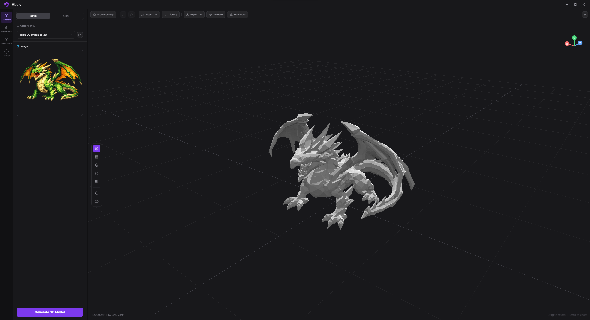

<p align="center">
  
</p>

<h1 align="center">Modly</h1>

<p align="center"><strong>A local-first 3D creation workspace, being extended into an AMD-native semantic 3D pipeline.</strong></p>

<p align="center">
  
</p>

Modly is an open-source desktop application for creating and working with 3D assets through visual workflows and model extensions. This project extends Modly's existing workflow and extension architecture toward editable assets that combine geometry with semantic parts, material regions, PBR properties, confidence, and provenance.

The semantic 3D pipeline is under active development. Its audited requirements and implementation order are documented in the [final specification](MODLY_AMD_SEMANTIC_3D_HANDOFF/spec/FINAL_AUDITED_SPEC.md) and [ticket index](MODLY_AMD_SEMANTIC_3D_HANDOFF/tickets/TICKET_INDEX.md). Those documents define the target; they should not be read as a claim that every planned capability is already available.

## Project direction

The goal is to take source imagery or an existing 3D asset through a traceable workflow that produces structured, editable results. The planned pipeline covers:

- Geometry generation or import.
- Native 3D part segmentation and separate semantic identification.
- Material-region segmentation and material identity.
- Evidence-backed PBR properties.
- Confidence state, provenance, intermediate artifacts, and user corrections.
- Validated GLB/glTF output with a structured sidecar for metadata that the interchange format cannot preserve directly.

Modly remains the control plane: workflows, extensions, the desktop viewer, and headless automation provide the host for these capabilities. Extensions remain replaceable behind versioned asset and capability contracts.

## AMD execution

The audited design targets AMD GPUs and uses the backend that fits each workload:

- **Torch-MIGraphX** for PyTorch modules that pass correctness and measured-performance checks.
- **PyTorch ROCm** as the neural inference path where MIGraphX is unsupported or not useful.
- **HIP** for reusable specialized 3D operations where native GPU kernels are appropriate.
- **Vulkan** only for suitable rendering, validation, or compute tasks; it is not the inference architecture.

The hardware acceptance target is a Radeon RX 7900 GRE with 16 GB of VRAM. The complete semantic pipeline and its target-hardware acceptance are still in progress; see the [implementation state](docs/orchestration/progress-state.md) for current evidence and remaining acceptance work.

## Modly today

The existing desktop application provides image-to-mesh workflows, a 3D viewer, model and process extensions, workflow execution, and a command-line interface for automation. Existing extensions can be installed from the **Models** page using their GitHub repository URL. The project preserves that extension and workflow architecture as the semantic pipeline is developed.

The application supports Windows, Linux, and Apple Silicon macOS. The AMD hardware acceptance target for this project is Linux with a supported Radeon GPU and ROCm environment.

## Run from source

### Requirements

- Node.js and npm.
- Python 3.10–3.12 for the API backend.
- A C/C++ build toolchain for Python packages that require local compilation.

The AMD GPU runtime is maintained as a separate project-owned container environment. Its [source-pinned build recipe](api/runtime/amd/Containerfile) and [dependency-lock status](api/runtime/amd/LOCK.md) are under development and are not yet a complete reproducible install. You do not need to install host-wide ROCm or replace an existing Python environment to run the desktop application or its standard development checks.

### Install dependencies

```bash
npm install
cd api
python -m venv .venv
```

Activate the environment, then install the API requirements:

```bash
# Linux or macOS
source .venv/bin/activate
pip install -r requirements.txt
```

```powershell
# Windows PowerShell
.venv\Scripts\Activate.ps1
pip install -r requirements.txt
```

Return to the repository root and start the desktop development app:

```bash
cd ..
npm run dev
```

## Workflows and extensions

Create or select a workflow in the **Workflows** area, connect compatible nodes, then run it from **Generate**. A simple image-to-mesh workflow uses an image input, a generation node, and an output or scene node.

Modly supports external model and process extensions. Extensions declare their manifests and capabilities so workflows can validate inputs and outputs while keeping model implementations independent from the host application. Examples from the existing extension ecosystem include:

- [Hunyuan3D Mini](https://github.com/lightningpixel/modly-hunyuan3d-mini-extension), [Mini Turbo](https://github.com/lightningpixel/modly-hunyuan3d-mini-turbo-extension), and [Mini Fast](https://github.com/lightningpixel/modly-hunyuan3d-mini-fast-extension).
- [TripoSG](https://github.com/lightningpixel/modly-triposg-extension).
- [Trellis2 GGUF](https://github.com/lightningpixel/modly-trellis2-gguf-extension).

## Command-line automation

The standard-library-based CLI can communicate with a running Modly API for health checks, model discovery, workflow runs, and process runs:

```bash
python tools/modly-cli/agent.py health
python tools/modly-cli/agent.py model list
python tools/modly-cli/agent.py workflow-run status <run_id>
```

Run `python tools/modly-cli/agent.py --help` for available commands and options. The CLI contract and usage guidance are in [`tools/modly-cli/SKILL.md`](tools/modly-cli/SKILL.md).

## Development checks

From the repository root:

```bash
npm test
npm run lint
npm run build
```

`npm test` runs the Python API tests and Node.js tests. The AMD GPU acceptance checks require the project runtime and target hardware; standard unit tests and a successful desktop build do not establish GPU acceptance.

## Contributing

Please read the [audited specification](MODLY_AMD_SEMANTIC_3D_HANDOFF/spec/FINAL_AUDITED_SPEC.md), [ticket dependency graph](MODLY_AMD_SEMANTIC_3D_HANDOFF/tickets/TICKET_INDEX.md), and [implementation state](docs/orchestration/progress-state.md) before taking on semantic-pipeline work. Tickets must meet their stated acceptance criteria before dependent work begins.

## Community

Join the [Modly Discord](https://discord.gg/BvjDCvS3yr) for discussion, feedback, and support.

## License and attribution

This project is distributed under the [MIT License](LICENSE). It builds on [Modly](https://github.com/lightningpixel/modly) by [Lightning Pixel](https://github.com/lightningpixel); retain the original copyright and license notices when redistributing the project. The license also asks application forks to credit Modly in the app UI or documentation.
